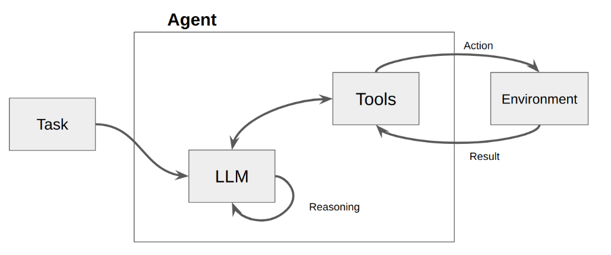
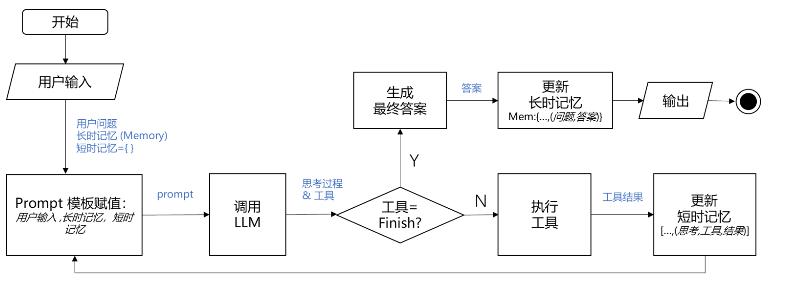

- [向量](#%E5%90%91%E9%87%8F)
  * [什么是向量](#%E4%BB%80%E4%B9%88%E6%98%AF%E5%90%91%E9%87%8F)
  * [向量间的相似度计算](#%E5%90%91%E9%87%8F%E9%97%B4%E7%9A%84%E7%9B%B8%E4%BC%BC%E5%BA%A6%E8%AE%A1%E7%AE%97)
    + [余弦距离（Cosine Distance）](#%E4%BD%99%E5%BC%A6%E8%B7%9D%E7%A6%BBcosine-distance)
    + [欧氏距离（Euclidean Distance）](#%E6%AC%A7%E6%B0%8F%E8%B7%9D%E7%A6%BBeuclidean-distance)
  * [文本向量化](#%E6%96%87%E6%9C%AC%E5%90%91%E9%87%8F%E5%8C%96)
    + [独热模型（One Hot Model）](#%E7%8B%AC%E7%83%AD%E6%A8%A1%E5%9E%8Bone-hot-model)
      - [原理](#%E5%8E%9F%E7%90%86)
      - [优缺点](#%E4%BC%98%E7%BC%BA%E7%82%B9)
      - [适用场景](#%E9%80%82%E7%94%A8%E5%9C%BA%E6%99%AF)
  * [向量数据库](#%E5%90%91%E9%87%8F%E6%95%B0%E6%8D%AE%E5%BA%93)
    + [安装](#%E5%AE%89%E8%A3%85)
    + [架构特点](#%E6%9E%B6%E6%9E%84%E7%89%B9%E7%82%B9)
      - [密集向量](#%E5%AF%86%E9%9B%86%E5%90%91%E9%87%8F)
      - [二进制向量](#%E4%BA%8C%E8%BF%9B%E5%88%B6%E5%90%91%E9%87%8F)
      - [稀疏向量](#%E7%A8%80%E7%96%8F%E5%90%91%E9%87%8F)
      - [相似度度量类型](#%E7%9B%B8%E4%BC%BC%E5%BA%A6%E5%BA%A6%E9%87%8F%E7%B1%BB%E5%9E%8B)
      - [向量索引](#%E5%90%91%E9%87%8F%E7%B4%A2%E5%BC%95)
        * [内存索引](#%E5%86%85%E5%AD%98%E7%B4%A2%E5%BC%95)
        * [磁盘索引](#%E7%A3%81%E7%9B%98%E7%B4%A2%E5%BC%95)
        * [GPU索引](#gpu%E7%B4%A2%E5%BC%95)
      - [非向量字段索引](#%E9%9D%9E%E5%90%91%E9%87%8F%E5%AD%97%E6%AE%B5%E7%B4%A2%E5%BC%95)
      - [一致性级别](#%E4%B8%80%E8%87%B4%E6%80%A7%E7%BA%A7%E5%88%AB)
    + [使用](#%E4%BD%BF%E7%94%A8)
      - [DataBase](#database)
      - [Collections](#collections)
      - [Schema & Data Fields](#schema--data-fields)
      - [Insert & Delete](#insert--delete)
      - [创建索引](#%E5%88%9B%E5%BB%BA%E7%B4%A2%E5%BC%95)
      - [Search & Rerank](#search--rerank)
        * [基于ANN算法搜索](#%E5%9F%BA%E4%BA%8Eann%E7%AE%97%E6%B3%95%E6%90%9C%E7%B4%A2)
        * [过滤搜索](#%E8%BF%87%E6%BB%A4%E6%90%9C%E7%B4%A2)
        * [范围搜索](#%E8%8C%83%E5%9B%B4%E6%90%9C%E7%B4%A2)
        * [混合搜索](#%E6%B7%B7%E5%90%88%E6%90%9C%E7%B4%A2)
        * [查询](#%E6%9F%A5%E8%AF%A2)
        * [过滤](#%E8%BF%87%E6%BB%A4)
        * [全文检索](#%E5%85%A8%E6%96%87%E6%A3%80%E7%B4%A2)
        * [Rerankers](#rerankers)
- [模型](#%E6%A8%A1%E5%9E%8B)
  * [向量模型](#%E5%90%91%E9%87%8F%E6%A8%A1%E5%9E%8B)
    + [bge-m3](#bge-m3)
    + [sentence-transformers](#sentence-transformers)
  * [Reranker模型](#reranker%E6%A8%A1%E5%9E%8B)
    + [BGE](#bge)
    + [Cross Encoder](#cross-encoder)
- [Advanced RAG](#advanced-rag)
  * [查询增强](#%E6%9F%A5%E8%AF%A2%E5%A2%9E%E5%BC%BA)
    + [创建假设问题](#%E5%88%9B%E5%BB%BA%E5%81%87%E8%AE%BE%E9%97%AE%E9%A2%98)
    + [创建子查询](#%E5%88%9B%E5%BB%BA%E5%AD%90%E6%9F%A5%E8%AF%A2)
    + [创建 StepBack Prompts](#%E5%88%9B%E5%BB%BA-stepback-prompts)
  * [增强索引](#%E5%A2%9E%E5%BC%BA%E7%B4%A2%E5%BC%95)
    + [构建分层索引](#%E6%9E%84%E5%BB%BA%E5%88%86%E5%B1%82%E7%B4%A2%E5%BC%95)
    + [混合检索和重新排名](#%E6%B7%B7%E5%90%88%E6%A3%80%E7%B4%A2%E5%92%8C%E9%87%8D%E6%96%B0%E6%8E%92%E5%90%8D)
  * [改进检索器](#%E6%94%B9%E8%BF%9B%E6%A3%80%E7%B4%A2%E5%99%A8)
    + [句子窗口检索](#%E5%8F%A5%E5%AD%90%E7%AA%97%E5%8F%A3%E6%A3%80%E7%B4%A2)
    + [元数据过滤](#%E5%85%83%E6%95%B0%E6%8D%AE%E8%BF%87%E6%BB%A4)
  * [Generator 增强](#generator-%E5%A2%9E%E5%BC%BA)
    + [压缩 LLM prompt](#%E5%8E%8B%E7%BC%A9-llm-prompt)
    + [调整 prompt 中的块顺序](#%E8%B0%83%E6%95%B4-prompt-%E4%B8%AD%E7%9A%84%E5%9D%97%E9%A1%BA%E5%BA%8F)
  * [增强 RAG Pipeline](#%E5%A2%9E%E5%BC%BA-rag-pipeline)
    + [自我反思](#%E8%87%AA%E6%88%91%E5%8F%8D%E6%80%9D)
    + [Query Routing with an Agent](#query-routing-with-an-agent)
- [LangChain](#langchain)
  * [模型 API](#%E6%A8%A1%E5%9E%8B-api)
    + [OpenAI 模型封装](#openai-%E6%A8%A1%E5%9E%8B%E5%B0%81%E8%A3%85)
    + [Ollama 封装](#ollama-%E5%B0%81%E8%A3%85)
    + [多轮对话 Session 封装](#%E5%A4%9A%E8%BD%AE%E5%AF%B9%E8%AF%9D-session-%E5%B0%81%E8%A3%85)
  * [模型的输入与输出](#%E6%A8%A1%E5%9E%8B%E7%9A%84%E8%BE%93%E5%85%A5%E4%B8%8E%E8%BE%93%E5%87%BA)
    + [Prompt 模板封装](#prompt-%E6%A8%A1%E6%9D%BF%E5%B0%81%E8%A3%85)
    + [从文件加载 Prompt 模板](#%E4%BB%8E%E6%96%87%E4%BB%B6%E5%8A%A0%E8%BD%BD-prompt-%E6%A8%A1%E6%9D%BF)
    + [结构化输出](#%E7%BB%93%E6%9E%84%E5%8C%96%E8%BE%93%E5%87%BA)
  * [Function Calling](#function-calling)
  * [数据连接封装](#%E6%95%B0%E6%8D%AE%E8%BF%9E%E6%8E%A5%E5%B0%81%E8%A3%85)
    + [文档加载器：Document Loaders](#%E6%96%87%E6%A1%A3%E5%8A%A0%E8%BD%BD%E5%99%A8document-loaders)
    + [文档处理器](#%E6%96%87%E6%A1%A3%E5%A4%84%E7%90%86%E5%99%A8)
      - [TextSplitter](#textsplitter)
    + [向量数据库与向量检索](#%E5%90%91%E9%87%8F%E6%95%B0%E6%8D%AE%E5%BA%93%E4%B8%8E%E5%90%91%E9%87%8F%E6%A3%80%E7%B4%A2)
      - [向量模型](#%E5%90%91%E9%87%8F%E6%A8%A1%E5%9E%8B-1)
  * [对话历史管理](#%E5%AF%B9%E8%AF%9D%E5%8E%86%E5%8F%B2%E7%AE%A1%E7%90%86)
    + [历史记录的剪裁](#%E5%8E%86%E5%8F%B2%E8%AE%B0%E5%BD%95%E7%9A%84%E5%89%AA%E8%A3%81)
    + [过滤带标识的历史记录](#%E8%BF%87%E6%BB%A4%E5%B8%A6%E6%A0%87%E8%AF%86%E7%9A%84%E5%8E%86%E5%8F%B2%E8%AE%B0%E5%BD%95)
  * [LCEL](#lcel)
    + [Pipeline 式调用 PromptTemplate, LLM 和 OutputParser](#pipeline-%E5%BC%8F%E8%B0%83%E7%94%A8-prompttemplate-llm-%E5%92%8C-outputparser)
    + [流式输出](#%E6%B5%81%E5%BC%8F%E8%BE%93%E5%87%BA)
    + [用 LCEL 实现 RAG](#%E7%94%A8-lcel-%E5%AE%9E%E7%8E%B0-rag)
    + [用 LCEL 实现工厂模式（选）](#%E7%94%A8-lcel-%E5%AE%9E%E7%8E%B0%E5%B7%A5%E5%8E%82%E6%A8%A1%E5%BC%8F%E9%80%89)
    + [存储与管理对话历史](#%E5%AD%98%E5%82%A8%E4%B8%8E%E7%AE%A1%E7%90%86%E5%AF%B9%E8%AF%9D%E5%8E%86%E5%8F%B2)
  * [LangServe](#langserve)
  * [智能体架构：Agent](#%E6%99%BA%E8%83%BD%E4%BD%93%E6%9E%B6%E6%9E%84agent)
    + [什么是智能体（Agent）](#%E4%BB%80%E4%B9%88%E6%98%AF%E6%99%BA%E8%83%BD%E4%BD%93agent)
    + [智能体类型：ReAct](#%E6%99%BA%E8%83%BD%E4%BD%93%E7%B1%BB%E5%9E%8Breact)
      - [LangChain Hub](#langchain-hub)
      - [google搜索API](#google%E6%90%9C%E7%B4%A2api)
    + [智能体类型：SelfAskWithSearch](#%E6%99%BA%E8%83%BD%E4%BD%93%E7%B1%BB%E5%9E%8Bselfaskwithsearch)
    + [手动实现一个Agent](#%E6%89%8B%E5%8A%A8%E5%AE%9E%E7%8E%B0%E4%B8%80%E4%B8%AAagent)
      - [Agent的核心流程](#agent%E7%9A%84%E6%A0%B8%E5%BF%83%E6%B5%81%E7%A8%8B)
      - [实现步骤](#%E5%AE%9E%E7%8E%B0%E6%AD%A5%E9%AA%A4)


# 向量
## 什么是向量  
向量是一种有大小和方向的数学对象。它可以表示为从一个点到另一个点的有向线段。例如，二维空间中的向量可以表示为(x, y)，表示从原点(0, 0)到点(x, y)的有向线段。      
    
**以此类推，我可以用一组坐标(x0,x1,...,xn-1)表示一个N维空间中的向量，N叫做向量的维度。**

## 向量间的相似度计算 
     

### 余弦距离（Cosine Distance）
如上图所示，余弦距离为两个向量之间的夹角度数的**余弦值**。  
当夹角度数越小时，两个向量越相似。当夹角度数趋于0时，余弦值趋于最大值1。**因此余弦距离越大说明两个向量越相似。**
### 欧氏距离（Euclidean Distance）
如上图所示，欧式距离是N维空间中两个点之间的真实距离。   
**所以欧式距离越小说明两个向量越相似。**

## 文本向量化
文本向量化的核心在于将非结构化的文本数据转换为结构化的数值向量。    
常见的文本向量化方法包括独热模型（One Hot Model）、词袋模型（Bag of Words Model）、词频-逆文档频率（TF-IDF）、N元模型（N-Gram）、单词-向量模型（Word2vec）以及文档-向量模型（Doc2vec）等。
### 独热模型（One Hot Model）
#### 原理
1. 问题由来   
在很多机器学习任务中，特征并不总是连续值，而有可能是分类值，比如人的性别、衣服的颜色等。这些称为**离散特征**，离散特征可以分为两类：  
1）离散特征之间没有大小的意义，如衣服颜色等  
2）离散特征之间有大小意义，如衣服尺码X、XL、XXL等  
而我们的目标就是要计算这些特征之间的相似度。对于有大小意义的特征我们假设给他们从小到大映射数值，然后来计算其之间的“距离”（这只是为了方便理解假设的一种方式）。但是对于没有大小意义的离散特征，我们如何计算相似度？
2. one-hot encoding     
one-hot就是为了解决这一问题而来的。one-hot又称一位有效编码，其方法是使用N位状态寄存器来对N个状态进行编码，每个状态都由他独立的寄存器位，并且在任意时候，其中只有一位有效。   
举个例子说明，比如血型这个特征，一共有四种类别（A,B,AB,O），采用one-hot编码后，会把血型变成有一个4维的稀疏向量：  
A表示为（1,0,0,0）  
B表示为（0,1,0,0）  
AB表示为（0,0,1,0）  
O表示为（0,0,0,1）  
有几个类别，就会生成几维的稀疏向量。有了向量就可以计算它们之间的相似度了。
#### 优缺点
优点：独热编码解决了分类器不好处理属性数据的问题，在一定程度上也起到了扩充特征的作用。它的值只有0和1，不同的类型存储在垂直的空间。   
缺点：类别的数量很多时，特征空间会变得非常大。在这种情况下，一般可以用PCA来减少维度。而且one hot encoding+PCA这种组合在实际中也非常有用。
#### 适用场景
适合：独热编码用来解决类别型数据的离散值问题。   
不适合：将离散型特征进行one-hot编码的作用，是为了让距离计算更合理，但如果特征是离散的，并且不用one-hot编码就可以很合理的计算出距离，那么就没必要进行one-hot编码。

## 向量数据库
本文重点讲解Milvus
### 安装
Milvus提供了三种部署模式，分别是Milvus Lite、Milvus Standalone、Milvus Distributed。    
Milvus Lite是最轻量化的方式，实质就是一个Python library。这种方式的目的是为了让用户在有限的资源下快速体验Milvus。     
Milvus Standalone是本地单机部署模式，使用Docker来部署。      
Milvus Distributed是生产环境的部署模式，是基于Kubernetes云原生的集群部署。      
下面演示Milvus Standalone部署   
环境：windows   
前提条件：[安装 Docker Desktop](https://docs.docker.com/desktop/setup/install/windows-install/)   
1. 在管理员模式下右击并选择以管理员身份运行，打开 Docker Desktop。 
2. 下载安装脚本并将其保存为standalone.bat 。
```shell
C:\>Invoke-WebRequest https://raw.githubusercontent.com/milvus-io/milvus/refs/heads/master/scripts/standalone_embed.bat -OutFile standalone.bat
```
3. 运行下载的脚本，将 Milvus 作为 Docker 容器启动。
```shell
C:\>standalone.bat start
Wait for Milvus starting...
Start successfully.
To change the default Milvus configuration, edit user.yaml and restart the service.
```
4. 可以使用以下命令管理 Milvus 容器和存储的数据。
```shell
C:\>standalone.bat stop
Stop successfully.

C:\>standalone.bat delete
Delete Milvus container successfully. # Container has been removed.
Delete successfully. # Data has been removed.
```
### 架构特点
#### 密集向量
1. 概念   
密集向量由包含实数的数组组成，其中大部分或所有元素都不为零。与稀疏向量相比，密集向量在同一维度上包含更多信息，因为每个维度都持有有意义的值。这种表示方法能有效捕捉复杂的模式和关系，使数据在高维空间中更容易分析和处理。密集向量通常有固定的维数，从几十到几百甚至上千不等，具体取决于具体的应用和要求。       
1.1 多维表示：每一个点表示一个object，其位置由其维度值决定   
1.2 语义关系：点之间的距离反映了概念之间的语义相似性。距离较近的点表示语义关联度较高的概念      
1.3 聚类效应：相关概念（如Milvus、向量数据库和检索系统）在空间中的位置相互靠近，形成语义聚类     
2. 适用场景     
密集向量主要用于需要理解数据语义的场景，如语义搜索和推荐系统。    
2.1 在语义搜索中，密集向量有助于捕捉查询和文档之间的潜在联系，提高搜索结果的相关性。      
2.2 在推荐系统中，密集矢量有助于识别用户和项目之间的相似性，从而提供更加个性化的建议。
3. 支持的向量模型   
3.1 图像的 CNN 模型（如ResNet、VGG）   
3.2 用于文本的语言模型（如BERT、Word2Vec）
4. 在 Milvus 中使用密集向量    
````python
from pymilvus import MilvusClient, DataType

client = MilvusClient(uri="http://localhost:19530")

schema = client.create_schema(
    auto_id=True,
    enable_dynamic_fields=True,
)

schema.add_field(field_name="pk", datatype=DataType.VARCHAR, is_primary=True, max_length=100)
schema.add_field(field_name="dense_vector", datatype=DataType.FLOAT_VECTOR, dim=4)
````
1）将datatype 设置为受支持的密集向量数据类型   

|类型|描述|
|:----|:----|
|FLOAT_VECTOR|存储 32 位浮点数，常用于表示科学计算和机器学习中的实数。非常适合需要高精度的场景，例如区分相似向量。|
|FLOAT16_VECTOR|存储 16 位半精度浮点数，用于深度学习和 GPU 计算。在精度要求不高的情况下，如推荐系统的低精度召回阶段，它可以节省存储空间。|
|BFLOAT16_VECTOR|存储 16 位脑浮点（bfloat16）数，提供与 Float32 相同的指数范围，但精度有所降低。适用于需要快速处理大量向量的场景，如大规模图像检索。|

2）使用dim 参数指定密集向量的维数    
上面代码中我们添加了一个名为dense_vector 的向量字段来存储密集向量。字段的数据类型为FLOAT_VECTOR ，维数为4 。       

#### 二进制向量
1. 概念      
二进制向量是一种将复杂对象（如图像、文本或音频）编码为固定长度二进制值的方法。在 Milvus 中，二进制向量通常表示为比特数组或字节数组。例如，一个 8 维二进制向量可以表示为[1, 0, 1, 1, 0, 0, 1, 0] 。   
二进制向量是一种特殊的数据表示形式，它将传统的高维浮点向量转换为只包含 0 和 1 的二进制向量。这种转换不仅压缩了向量的大小，还降低了存储和计算成本，同时保留了语义信息。
2. 二进制向量特点   
2.1 高效存储：每个维度只需 1 位存储空间，大大减少了存储空间。   
2.2 快速计算：可以使用 XOR 等位运算快速计算向量之间的相似性。    
2.3 固定长度：无论原始文本的长度如何，向量的长度保持不变，从而使索引和检索更加容易。     
2.4 简单直观：直接反映关键词的存在，适合某些专业检索任务。
3. 适用场景    
3.1 对非关键特征的精度要求不高时，二进制向量可以有效保持原始浮点向量的大部分完整性和实用性       
3.2 在计算效率和存储优化至关重要的情况下，例如在搜索引擎或推荐系统等大规模人工智能系统中，**实时处理海量数据**是关键所在     
3.3 通过减小向量的大小，二进制向量有助于降低延迟和计算成本，而不会明显牺牲准确性     
3.4 在移动设备和嵌入式系统等资源受限的环境中也很有用    
3.5 通过使用二进制向量，可以在这些受限环境中实现复杂的人工智能功能，同时保持高性能。   
4. 二进制向量的缺点   
虽然二进制向量在特定场景中表现出色，但其表达能力存在局限性，难以捕捉复杂的语义关系。因此，在实际应用场景中，二进制向量通常与其他向量类型一起使用，以平衡效率和表达能力。
5. 在 Milvus 中使用二进制向量
````python
from pymilvus import MilvusClient, DataType

client = MilvusClient(uri="http://localhost:19530")

schema = client.create_schema(
    auto_id=True,
    enable_dynamic_fields=True,
)

schema.add_field(field_name="pk", datatype=DataType.VARCHAR, is_primary=True, max_length=100)
schema.add_field(field_name="binary_vector", datatype=DataType.BINARY_VECTOR, dim=128)
````
在此示例中，添加了一个名为binary_vector 的向量字段，用于存储二进制向量。该字段的数据类型为BINARY_VECTOR ，维数为 128。

#### 稀疏向量
1. 概念
稀疏向量是高维向量的一种特殊表示形式，其中大部分元素为零，只有少数维度具有非零值   
2. 适用场景    
在涉及需要精确匹配关键词或短语的应用时，稀疏向量往往能提供更精确的结果。    
2.1 文本分析：将文档表示为词袋向量，其中每个维度对应一个单词，只有在文档中出现的单词才有非零值。    
2.2 推荐系统：用户-物品交互矩阵，其中每个维度代表用户对特定物品的评分，大多数用户只与少数物品交互。   
2.3 图像处理：局部特征表示，只关注图像中的关键点，从而产生高维稀疏向量。   
3. 在 Milvus 中使用稀疏向量  
3.1 生成稀疏向量    
稀疏向量可以使用多种方法生成，例如文本处理中的TF-IDF（词频-反向文档频率）和BM25。此外，Milvus 还提供了帮助生成和处理稀疏向量的便捷方法。      
3.2 添加稀疏向量字段
```python
from pymilvus import MilvusClient, DataType

client = MilvusClient(uri="http://localhost:19530")

client.drop_collection(collection_name="my_sparse_collection")

schema = client.create_schema(
    auto_id=True,
    enable_dynamic_fields=True,
)

schema.add_field(field_name="pk", datatype=DataType.VARCHAR, is_primary=True, max_length=100)
schema.add_field(field_name="sparse_vector", datatype=DataType.SPARSE_FLOAT_VECTOR)
```
&emsp;&emsp; 1）将datatype 设置为支持的稀疏向量数据类型，即SPARSE_FLOAT_VECTOR  
&emsp;&emsp; 2）无需指定维度   
&emsp;&emsp; 3）在此示例中，添加了一个名为sparse_vector 的向量字段，用于存储稀疏向量。该字段的数据类型为SPARSE_FLOAT_VECTOR   

#### 相似度度量类型
相似度量用于衡量向量之间的相似性。选择合适的距离度量有助于显著提高分类和聚类性能。  
目前 Milvus 支持的度量类型如下：   

|度量类型|中文描述|相似性距离值的特征 |相似性距离值范围|
|:----|:----|:----|:----|
|L2|欧氏距离|值越小表示相似度越高。|[0, ∞)|
|IP|内积 |数值越大，表示相似度越高。|[-1, 1]|
|COSINE|余弦相似度|数值越大，表示相似度越高。|[-1, 1]|
|JACCARD|jaccard相似度|数值越小，表示相似度越高。|[0, 1]|
|HAMMING|汉明距离|值越小，表示相似度越高。|0，dim(向量)] [0, dim(vector)|
|BM25|BM25 相似性|根据词频、反转文档频率和文档规范化对相关性进行评分。|[0, ∞)|

不同字段类型与相应度量类型之间的映射关系：  

|字段类型|所属向量|维度范围|支持的度量类型|默认度量类型|
|:----|:----|:----|:----|:----|
|FLOAT_VECTOR|密集向量|2-32,768|COSINE,L2,IP|COSINE|
|FLOAT16_VECTOR|密集向量|2-32,768|COSINE,L2,IP|COSINE|
|BFLOAT16_VECTOR|密集向量|2-32,768|COSINE,L2,IP|COSINE|
|SPARSE_FLOAT_VECTOR|稀疏向量|无需指定维度。|IP,BM25 （仅用于全文检索|IP|
|BINARY_VECTOR|二进制向量|8-32,768*8|HAMMING,JACCARD|HAMMING|

#### 向量索引
##### 内存索引
Milvus支持的大多数向量索引都使用ANNS（近似近邻检索）算法。ANNS 的核心理念不再局限于返回最精确的结果，而是只搜索目标的近邻。ANNS 通过在可接受的范围内牺牲精确度来提高检索效率。   
ANNS 向量索引可分为四种类型：
* Tree-based
* Graph-based
* Hash-based
* Quantization-based  

```text
Tips: 
精确率=检索出的相关信息量 / 检索出的信息总量
召回率=检索出的相关信息量 / 系统中的相关信息总量
```

1、密集向量支持的索引类型

|支持的索引|分类| 场景                             |
|:----|:----|:-------------------------------|
|FLAT|N/A| 1）数据集相对较小 2）需要 100% 的召回率       |
|IVF_FLAT|N/A| 1）高速查询  2）要求尽可能高的召回率           |
|IVF_SQ8|Quantization-based| 1）极高速查询 2）内存资源有限 3）可接受召回率略有下降  |
|IVF_PQ|Quantization-based| 1）高速查询 2）内存资源有限 3）可略微降低召回率     |
|HNSW|Graph-based| 1）极高速查询 2）要求尽可能高的召回率 3）内存资源大   |
|HNSW_SQ|Quantization-based| 1）非常高速的查询 2）内存资源有限 3）可略微降低召回率  |
|HNSW_PQ|Quantization-based| 1）中速查询 2）内存资源非常有限 3）在召回率方面略有妥协 |
|HNSW_PRQ|Quantization-based| 1）中速查询 2）内存资源非常有限 3）召回率略有下降    |
|SCANN|Quantization-based| 1）极高速查询 2）要求尽可能高的召回率 3）内存资源大   |

2、二进制向量支持的索引类型

|支持的索引|分类|场景|
|:----|:----|:----|
|BIN_FLAT|Quantization-based|1）取决于相对较小的数据集。2）要求完全准确。3）无需压缩。4）保证精确的搜索结果。|
|BIN_IVF_FLAT|Quantization-based|1）高速查询 2）要求尽可能高的召回率|

3、稀疏向量支持的索引类型

|支持的索引| 分类            |场景|
|:----|:--------------|:----|
|SPARSE_INVERTED_INDEX	| Inverted index|1）取决于相对较小的数据集。2）要求 100%的召回率。|

##### 磁盘索引
Milvus磁盘索引基于DiskANN算法。   
1. DiskANN 默认为禁用。如果你更喜欢内存索引而不是磁盘索引，建议你禁用该功能以获得更好的性能。  
2. 要重新启用该功能，可将queryNode.enableDisk 设为true  
3. Milvus 实例在 Ubuntu 18.04.6 或更高版本上运行。 
4. Milvus 数据路径应挂载到 NVMe SSD 上，以充分发挥性能。

##### GPU索引
Milvus 支持各种 GPU 索引类型，以加快搜索性能和效率，尤其是在高吞吐量和高调用场景中。   
值得注意的是，与使用 CPU 索引相比，使用 GPU 索引并不一定能减少延迟。**如果想完全最大化吞吐量，则需要极高的请求压力或大量的查询向量。**    
Milvus 目前支持的 GPU 索引类型如下表：  

|索引类型|GPU内存要求|场景|
|:----|:----|:----|
|GPU_CAGRA|内存使用量约为原始向量数据的 1.8 倍。||
|GPU_IVF_FLAT|需要与原始数据大小相等的内存。||
|GPU_IVF_PQ|占用内存较少，具体取决于压缩参数设置。||
|GPU_BRUTE_FORCE|需要与原始数据大小相等的内存。|GPU_BRUTE_FORCE 专为对召回率要求极高的情况定制，通过将每个查询与数据集中的所有向量进行比较，保证召回率为 1。|

#### 非向量字段索引
Milvus 支持向量字段和非向量字段的联合过滤搜索。为了提高非向量字段的搜索效率，Milvus 从 2.1.0 版开始引入了标量字段索引。    
1. Milvus中标量字段索引原理   
1.1 用逻辑操作符先将标量字段组织成布尔表达式   
1.2 当 Milvus 收到带有这种布尔表达式的搜索请求时，它会将布尔表达式解析为抽象语法树（AST），以生成用于属性筛选的物理计划    
1.3 然后，Milvus 在每个分段中应用物理计划，生成一个比特集作为过滤结果，并将结果作为向量搜索参数，以缩小搜索范围    
1.4 在这种情况下，向量搜索的速度在很大程度上依赖于属性过滤的速度。    
2. 标量字段索引算法  
Milvus 的标量字段索引算法旨在实现低内存占用率、高过滤效率和短加载时间。这些算法主要分为两类：auto indexing（自动索引）和inverted indexing（反转索引）     
2.1 auto indexing       
Milvus 提供了AUTOINDEX 选项，让你无需手动选择索引类型。调用create_index 方法时，如果没有指定index_type ，Milvus 会根据数据类型自动选择最合适的索引类型。       
2.2 inverted indexing  
倒排索引有两个主要部分：术语字典和倒排列表。如下图例子：  
     
图中有两行数据，假定它们的所在列的主键分别是0和1，术语词典则记录了所有标记词（按字母顺序排列）。   
1）点查询：例如，在搜索包含单词Milvus 的文档时，首先要检查术语字典中是否存在Milvus。如果没有找到，则没有文档包含该词。但如果找到了，则会检索与Milvus相关的倒序列表，指出包含该词的文档。这种方法比在一百万个文档中进行暴力搜索要有效得多，因为排序后的术语词典大大降低了查找Milvus 这个词的时间复杂度。   
2）范围查询：范围查询（如查找单词字母大于very 的文档）的效率也能通过排序术语字典得到提高。这种方法比暴力搜索更有效，能提供更快、更准确的结果。

#### 一致性级别
Milvus支持的一致性级别包含：  
* Strong（强）  
* Bounded（有限制的）  
* Eventually（最终一致性）  
* Session（会话）  

默认为Bounded。    

设置一致性级别：
````python
client.create_collection(
    collection_name="my_collection",
    schema=schema,
    # highlight-next
    consistency_level="Strong",
)
````
consistency_level 参数的可能值是Strong 、Bounded 、Eventually 和Session。

### 使用
#### DataBase
数据库的概念和其他数据库中间件的概念也是一样的，比如Mysql中的DataBase等。
1. 创建数据库
````python
from pymilvus import connections, db
conn = connections.connect(host="127.0.0.1", port=19530)
database = db.create_database("my_database")
````
2. 使用数据库
````python
db.using_database("my_database")
````
或者
````python
conn = connections.connect(
    host="127.0.0.1",
    port="19530",
    db_name="my_database"
)
````
3. 列出数据库
````python
db.list_database()

['default', 'my_database']
````
4. 删除数据库
````python
db.drop_database("my_database")
db.list_database()
['default']
````
#### Collections
Collection 和实体 类似于关系数据库中的表和记录。   
Collection 是一个二维表，具有固定的列和变化的行。每列代表一个字段，每行代表一个实体。  
一个Collection中的要素：
1. Schema 和字段   
在描述一个对象时，我们通常会提到它的属性，如大小、重量和位置。您可以将这些属性用作 Collection 中的字段。每个字段都有各种约束属性，例如向量字段的数据类型和维度。通过创建字段并定义其顺序，可以形成一个 Collections Schema。
2. 主键和 AutoId   
与关系数据库中的主字段类似，Collection 也有一个主字段，用于将实体与其他实体区分开来。主字段中的每个值都是全局唯一的，并与一个特定实体相对应。       
主键可以自己定义，也可以使用Milvus自增主键：   
2.1 定义自增主键   
将datatype 设置为DataType.INT64 ，将is_primary 设置为true，将auto_id 设置为true   
````python
from pymilvus import MilvusClient, DataType

schema = MilvusClient.create_schema()

schema.add_field(
    field_name="my_id",
    datatype=DataType.INT64,
    # highlight-start
    is_primary=True,
    auto_id=True,
    # highlight-end
)
````
3. 索引   
为特定字段创建索引可提高搜索效率。建议您为服务所依赖的所有字段创建索引，其中向量字段的索引是强制性的。      
在 创建索引 中详细说明。
4. 实体
5. 加载和释放   
加载集合是在集合中进行相似性搜索和查询的前提。加载 Collections 时，Milvus 会将所有索引文件和每个字段中的原始数据加载到内存中，以便快速响应搜索和查询。    
搜索和查询是内存密集型操作。为节约成本，建议您释放当前不使用的 Collections。  
6. 搜索和查询   
在 Search & Rerank 详细说明
7. 分区   
7.1 分区是集合的子集，与其父集合共享相同的字段集，每个分区包含一个实体子集。  
7.2 通过将实体分配到不同的分区，可以创建实体组。你可以在特定分区中进行搜索和查询，让 Milvus 忽略其他分区中的实体，提高搜索效率。     
7.3 分区是 Collections 的水平切片。每个分区对应一个数据输入通道。每个 Collections 默认都有一个分区。创建 Collections 时，可以根据预期吞吐量和要插入 Collections 的数据量设置适当的分区数量。
8. 一致性级别   
分布式数据库系统通常使用一致性级别来定义跨数据节点和副本的数据相同性。在创建 Collections 或在 Collections 中进行相似性搜索时，可以分别设置不同的一致性级别。适用的一致性级别有强、有限制的不稳定性、会话和最终。

#### Schema & Data Fields
Schema 用于定义 Collections 的属性和其中的字段。  
1. 创建Field Schema
````python
from pymilvus import DataType, FieldSchema
id_field = FieldSchema(name="id", dtype=DataType.INT64, is_primary=True, description="primary id")
age_field = FieldSchema(name="age", dtype=DataType.INT64, description="age")
embedding_field = FieldSchema(name="embedding", dtype=DataType.FLOAT_VECTOR, dim=128, description="vector")

position_field = FieldSchema(name="position", dtype=DataType.VARCHAR, max_length=256, is_partition_key=True)
````
1.1 name、dtype、description、max_length这些都不必说了    
1.2 dim 向量的维数，密集向量场必须使用，稀疏向量省略  
1.3 default_value 默认字段值    
1.4 is_partition_key 用作 Partition Key 的字段名称
2. 创建Collection schema    
```python
from pymilvus import CollectionSchema
schema = CollectionSchema(fields=[id_field, age_field, embedding_field], auto_id=False, enable_dynamic_field=True, description="desc of a collection")
```
3. 创建Collection
````python
from pymilvus import Collection, connections
conn = connections.connect(host="127.0.0.1", port=19530)
collection_name1 = "tutorial_1"
collection1 = Collection(name=collection_name1, schema=schema, using='default', shards_num=2)
````
#### Insert & Delete
1. Insert
````python
from pymilvus import MilvusClient

client = MilvusClient(
    uri="http://localhost:19530",
    token="root:Milvus"
)

data=[
    {"id": 0, "vector": [0.3580376395471989, -0.6023495712049978, 0.18414012509913835, -0.26286205330961354, 0.9029438446296592], "color": "pink_8682"},
    {"id": 1, "vector": [0.19886812562848388, 0.06023560599112088, 0.6976963061752597, 0.2614474506242501, 0.838729485096104], "color": "red_7025"},
    {"id": 2, "vector": [0.43742130801983836, -0.5597502546264526, 0.6457887650909682, 0.7894058910881185, 0.20785793220625592], "color": "orange_6781"},
]

res = client.insert(
    collection_name="quick_setup",
    data=data
)

print(res)
# Output
# {'insert_count': 10, 'ids': [0, 1, 2, 3, 4, 5, 6, 7, 8, 9]}
````
2. Upsert    
**upsert操作必须要有主键。**
````python
from pymilvus import MilvusClient

client = MilvusClient(
    uri="http://localhost:19530",
    token="root:Milvus"
)

data=[
    {"id": 0, "vector": [-0.619954382375778, 0.4479436794798608, -0.17493894838751745, -0.4248030059917294, -0.8648452746018911], "color": "black_9898"},
    {"id": 1, "vector": [0.4762662251462588, -0.6942502138717026, -0.4490002642657902, -0.628696575798281, 0.9660395877041965], "color": "red_7319"},
    {"id": 2, "vector": [-0.8864122635045097, 0.9260170474445351, 0.801326976181461, 0.6383943392381306, 0.7563037341572827], "color": "white_6465"},
]

res = client.upsert(
    collection_name='quick_setup',
    data=data
)

print(res)
# Output
# {'upsert_count': 10}
````
3. Delete    
可以通过筛选条件或主键删除不再需要的实体。     
````python
from pymilvus import MilvusClient

client = MilvusClient(
    uri="http://localhost:19530",
    token="root:Milvus"
)

res = client.delete(
    collection_name="quick_setup",
    # highlight-next-line
    filter="color in ['red_3314', 'purple_7392']"
)

print(res)
# Output
# {'delete_count': 2}
````
通过主键删除实体：
````python
res = client.delete(
    collection_name="quick_setup",
    # highlight-next-line
    ids=[18, 19]
)

print(res)
````
#### 创建索引
这里重点讲解**基于内存索引**如何创建、删除等。

|数据类型| 度量类型                               | 索引类型                                                                                          |
|:----|:-----------------------------------|:----------------------------------------------------------------------------------------------|
|密集向量| 欧氏距离 (L2)<br/>内积 (IP)<br/>余弦相似度 (COSINE)| FLAT<br/>IVF_FLAT<br/>IVF_SQ8<br/>IVF_PQ<br/>GPU_IVF_FLAT<br/>GPU_IVF_PQ<br/>HNSW<br/>DISKANN |
|二进制向量|Jaccard (JACCARD)<br/>汉明 (HAMMING)| BIN_FLAT<br/>BIN_IVF_FLAT                                                                     |
|稀疏向量|内积 (IP)| SPARSE_INVERTED_INDEX                                                                         |
|标量字段|N/A| auto index（默认为空即为auto）<br/>INVERTED<br/>BITMAP                                                |

1、创建密集向量索引
````python
index_params = MilvusClient.prepare_index_params()

index_params.add_index(
    field_name="vector_field",
    metric_type="COSINE",
    index_type="IVF_FLAT",
    index_name="vector_index",
    params={ "nlist": 128 }
)

client.create_index(
    collection_name="customized_setup",
    index_params=index_params,
    sync=False # Whether to wait for index creation to complete before returning. Defaults to True.
)
````
IVF_FLAT详解：
1. 适用的场景是一、高速查询 二、要求尽可能高的召回率
2. IVF_FLAT 将向量数据划分为nlist 个聚类单元，然后比较目标输入向量与每个聚类中心之间的距离。根据系统设置查询的簇数 (nprobe)，相似性搜索结果仅根据目标输入与最相似簇中向量的比较结果返回--大大缩短了查询时间。
3. 通过调整nprobe ，可以在特定情况下找到准确性和速度之间的理想平衡。      
4. 索引构建参数  

|参数|说明|范围|默认值|
|:----|:----|:----|:----|
|nlist|群组单位数|[1, 65536]|128|

5. 搜索参数    
普通搜索:  

|参数|说明|范围|默认值|
|:----|:----|:----|:----|
|nprobe|要查询的单位数|[1，nlist］|8|

&emsp;&emsp; 范围搜索: 

|参数|说明|范围|默认值|
|:----|:----|:----|:----|
|max_empty_result_buckets|未返回任何搜索结果的桶的最大数量。<br/>这是一个范围搜索参数，当连续空桶的数量达到指定值时，将终止搜索过程。<br/>增加该值可以提高召回率，但代价是增加搜索时间。|[1, 65535]|2|

2、创建二进制向量索引    
````python
index_params = client.prepare_index_params()

index_params.add_index(
    field_name="binary_vector",
    index_name="binary_vector_index",
    index_type="BIN_IVF_FLAT",
    metric_type="HAMMING",
    params={"nlist": 128}
)
````
在上面的示例中：   
索引名为：binary_vector_index   
索引类型为：BIN_IVF_FLAT          
度量类型为：HAMMING，表示使用汉明距离进行相似性测量。   

BIN_IVF_FLAT详解：  
该指标与 IVF_FLAT 完全相同，只是只能用于二进制嵌入。   
因此其原理、参数都可参考IVF_FLAT的。

3、创建稀疏向量索引   
````python
index_params = client.prepare_index_params()

index_params.add_index(
    field_name="sparse_vector",
    index_name="sparse_inverted_index",
    index_type="SPARSE_INVERTED_INDEX",
    metric_type="IP",
    params={"inverted_index_algo": "DAAT_MAXSCORE"},
)
````
1）index_type为索引类型，有效值： 
*   SPARSE_INVERTED_INDEX:稀疏向量的通用反转索引。    

2）metric_type:用于计算稀疏向量之间相似性的度量。有效值：   
*   IP (内积）：使用点积来衡量相似性。
*   BM25:通常用于全文搜索，侧重于文本相似性。

3）params.inverted_index_algo:用于建立和查询索引的算法。有效值：
*   "DAAT_MAXSCORE" (默认值）：maxScore 通过跳过可能影响最小的术语和文档，为高 k 值或包含大量术语的查询提供更好的性能。
*   "DAAT_WAND"：wand算法利用最大影响分数跳过非竞争性文档，从而评估较少的命中文档，但每次命中的开销较高。
*   "TAAT_NAIVE"

SPARSE_INVERTED_INDEX详解：  
1. 索引构建参数

|参数|取值|含义|
|:----|:----|:----|
|inverted_index_algo|DAAT_MAXSCORE||
||DAAT_WAND||
||TAAT_NAIVE||

2. 搜索参数   

|参数|含义|
|:----|:----|
|drop_ratio_search|允许在搜索过程中对查询向量中的小值进行微调。例如，使用{"drop_ratio_search": 0.2} 时，查询向量中最小的 20% 值将在搜索过程中被忽略。|

#### Search & Rerank
##### 基于ANN算法搜索
1、简单介绍原理  
常用的向量相似性检索算法有两种：  
一、KNN(k-Nearest Neighbors) 翻译为K-近邻算法。此算法必须将向量空间中的所有向量与搜索请求中携带的查询向量进行比较，然后找出最相似的向量，这既耗时又耗费资源。     
二、ANN(Approximate Nearest Neighbor) 翻译为近似近邻。该算法要求提供一个索引文件，记录向量 Embeddings 的排序顺序。当收到搜索请求时，可以使用索引文件作为参考，快速找到可能包含与查询向量最相似的向量嵌入的子组。然后，你可以使用指定的度量类型来测量查询向量与子组中的向量之间的相似度，根据与查询向量的相似度对组成员进行排序，并找出前 K 个组成员。       

2、单个向量检索   
在 ANN 搜索中，单向量搜索指的是只涉及一个查询向量的搜索。根据预建索引和搜索请求中携带的度量类型，Milvus 将找到与查询向量最相似的前 K 个向量。   
````python
from pymilvus import MilvusClient

client = MilvusClient(
    uri="http://localhost:19530",
    token="root:Milvus"
)

query_vector = [0.3580376395471989, -0.6023495712049978, 0.18414012509913835, -0.26286205330961354, 0.9029438446296592]
res = client.search(
    collection_name="my_collection",
    anns_field="vector",
    data=[query_vector],
    limit=3, # 返回3条数据
    search_params={"metric_type": "IP"} # 度量类型为"IP"
)

for hits in res:
    for hit in hits:
        print(hit)
# [
#     [
#         {
#             "id": 551,
#             "distance": 0.08821295201778412,
#             "entity": {}
#         },
#         {
#             "id": 296,
#             "distance": 0.0800950899720192,
#             "entity": {}
#         },
#         {
#             "id": 43,
#             "distance": 0.07794742286205292,
#             "entity": {}
#         }
#     ]
# ]

````
3、多个向量检索   
````python
query_vectors = [
    [0.041732933, 0.013779674, -0.027564144, -0.013061441, 0.009748648],
    [0.0039737443, 0.003020432, -0.0006188639, 0.03913546, -0.00089768134]
]

res = client.search(
    collection_name="my_collection",
    data=query_vectors,
    limit=3,
)

for hits in res:
    print("TopK results:")
    for hit in hits:
        print(hit)
# Output
#
# [
#     [
#         {
#             "id": 551,
#             "distance": 0.08821295201778412,
#             "entity": {}
#         },
#         {
#             "id": 296,
#             "distance": 0.0800950899720192,
#             "entity": {}
#         },
#         {
#             "id": 43,
#             "distance": 0.07794742286205292,
#             "entity": {}
#         }
#     ],
#     [
#         {
#             "id": 730,
#             "distance": 0.04431751370429993,
#             "entity": {}
#         },
#         {
#             "id": 333,
#             "distance": 0.04231833666563034,
#             "entity": {}
#         },
#         {
#             "id": 232,
#             "distance": 0.04221535101532936,
#             "entity": {}
#         }
#     ]
# ]
````

4、在分区中进行 ANN 搜索
````python
query_vector = [0.3580376395471989, -0.6023495712049978, 0.18414012509913835, -0.26286205330961354, 0.9029438446296592]
res = client.search(
    collection_name="my_collection",
    # highlight-next-line
    partition_names=["partitionA"], # 指定要查询的分区
    data=[query_vector],
    limit=3,
)

for hits in res:
    print("TopK results:")
    for hit in hits:
        print(hit)
# [
#     [
#         {
#             "id": 551,
#             "distance": 0.08821295201778412,
#             "entity": {}
#         },
#         {
#             "id": 296,
#             "distance": 0.0800950899720192,
#             "entity": {}
#         },
#         {
#             "id": 43,
#             "distance": 0.07794742286205292,
#             "entity": {}
#         }
#     ]
# ]
````

5、指定输出实体字段  
````python
query_vector = [0.3580376395471989, -0.6023495712049978, 0.18414012509913835, -0.26286205330961354, 0.9029438446296592],

res = client.search(
    collection_name="quick_setup",
    data=[query_vector],
    limit=3, # The number of results to return
    search_params={"metric_type": "IP"},
    # highlight-next-line
    output_fields=["color"] # 这里指定输出color字段
)

print(res)
# [
#     [
#         {
#             "id": 551,
#             "distance": 0.08821295201778412,
#             "entity": {
#                 "color": "orange_6781"
#             }
#         },
#         {
#             "id": 296,
#             "distance": 0.0800950899720192,
#             "entity": {
#                 "color": "red_4794"
#             }
#         },
#         {
#             "id": 43,
#             "distance": 0.07794742286205292,
#             "entity": {
#                 "color": "grey_8510"
#             }
#         }
#     ]
# ]
````

6、增强 ANN 检索     
下面这些搜索都是为了增强ANN检索。

##### 过滤搜索
ANN 搜索能找到与指定向量嵌入最相似的向量嵌入。但是，搜索结果不一定总是正确的。您可以在搜索请求中包含过滤条件，这样 Milvus 就会在进行 ANN 搜索前进行元数据过滤，将搜索范围从整个 Collections 缩小到只搜索符合指定过滤条件的实体。   
在 Milvus 中，过滤搜索根据应用过滤的阶段分为两种类型——**标准过滤**和**迭代过滤**。    
1、标准过滤     
其原理总结如下：   
a. 首先根据过滤条件筛选下符合条件的实体     
b. 在过滤后的实体中进行 ANN 搜索   
c. 返回前 K 个实体。   
````python
from pymilvus import MilvusClient

client = MilvusClient(
    uri="http://localhost:19530",
    token="root:Milvus"
)

query_vector = [0.3580376395471989, -0.6023495712049978, 0.18414012509913835, -0.26286205330961354, 0.9029438446296592]

res = client.search(
    collection_name="my_collection",
    data=[query_vector],
    limit=5,
    # highlight-start
    filter='color like "red%" and likes > 50', # 这里使用标准过滤
    output_fields=["color", "likes"]
    # highlight-end
)

for hits in res:
    print("TopK results:")
    for hit in hits:
        print(hit)
````

2、迭代过滤  
2.1 标准过滤的缺点   
标准过滤过程能有效地将搜索范围缩小到很小的范围。但是，**过于复杂的过滤表达式**可能会导致非常高的搜索延迟。在这种情况下，迭代过滤可以作为一种替代方法，帮助减少标量过滤的工作量。     
2.2 迭代过滤的原理  
使用迭代过滤的搜索以迭代的方式执行向量搜索。迭代器返回的每个实体都要经过标量过滤，这个过程一直持续到达到指定的 topK 结果为止。   
2.3 迭代过滤的缺点   
不过，值得注意的是，迭代器一次处理一个实体。这种顺序方法可能会导致较长的处理时间或潜在的性能问题，尤其是在对大量实体进行标量过滤时。   
````python
from pymilvus import MilvusClient

client = MilvusClient(
    uri="http://localhost:19530",
    token="root:Milvus"
)

query_vector = [0.3580376395471989, -0.6023495712049978, 0.18414012509913835, -0.26286205330961354, 0.9029438446296592]

res = client.search(
    collection_name="my_collection",
    data=[query_vector],
    limit=5,
    # highlight-start
    filter='color like "red%" and likes > 50',
    output_fields=["color", "likes"],
    search_params={
        "hints": "iterative_filter"
    }    
    # highlight-end
)

for hits in res:
    print("TopK results:")
    for hit in hits:
        print(hit)
````
##### 范围搜索
        

用上面这个图来解释什么是范围搜索。    
图中的查询条件为：
````python
data = [0.1,-0.2,0.3,-0.4,0.5],
limit = 3,
search_params = {
  "metric_type":"COSINE",
  "params": {
    "radius": 0.4,
    "range_filter":0.6
  }
}
````
代码中使用 COSINE 距离，params的意思是搜索相似度在 **(radius,range_filter]** 范围内的向量，即 (0.4,0.6] 范围内的向量。   
这就是范围搜索。    
注意，对于不同的度量类型，radius 和 range_filter 的取值也不同，具体看下表：

|度量类型|名称|设置 radius 和 range_filter 的要求|
|:----|:----|:----|
|L2|L2 距离越小，表示相似度越高。|要忽略最相似的向量 Embeddings，请确保<br/>range_filter <= 距离 <radius|
|IP|IP 距离越大，表示相似度越高。|要忽略最相似的向量嵌入，请确保<br/>radius < 距离 <=range_filter|
|COSINE|COSINE 距离越大，表示相似度越高。|要忽略最相似的向量嵌入，请确保<br/>radius < 距离 <=range_filter|
|JACCARD|Jaccard 距离越小，表示相似度越高。|要忽略最相似的向量嵌入，请确保<br/>range_filter <= 距离 <radius|
|HAMMING|汉明距离越小，表示相似度越高。|要忽略最相似的向量嵌入，请确保<br/>range_filter <= 距离 <radius|

##### 混合搜索
密集向量和稀疏向量上面已经做了详细的说明。混合搜索就是同时进行多个 ANN 搜索、对这些 ANN 搜索的多组结果进行 Rerankers 并最终返回一组结果的搜索方法。   
混合搜索的工作流程如下：   
1、通过BERT和Transformers 等向量模型生成密集向量  
2、通过BM25、BGE-M3、SPLADE 等向量模型生成稀疏向量  
3、创建 Collections 并定义 Collections Schema，其中包括密集向量场和稀疏向量   
4、将稀疏密集向量插入上一步刚刚创建的 Collections 中   
5、进行混合搜索：稠密向量上的 ANN 搜索将返回一组前 K 个最相似的结果，稀疏向量上的文本匹配也将返回一组前 K 个结果    
6、归一化：对两组 K 强结果的得分进行归一化，将得分转换为 [0,1] 之间的范围   
7、选择适当的 Rerankers 策略，对两组 Top-K 结果进行合并和重排，最终返回一组 Top-K 结果    

一个混合搜索的示例：[示例](advanced-rag%2Fhybrid-search%2FHybridSearch.py)     
1、创建具有多个向量的 Collections           
&emsp;&emsp; 1.1 定义 Schema     
&emsp;&emsp; 1.2 创建索引     
&emsp;&emsp; 1.3 创建 Collections     
2、插入数据      
3、创建多个 AnnSearchRequest 实例     
&emsp;&emsp; 混合搜索是通过在hybrid_search() 函数中创建多个AnnSearchRequest 来实现的，其中每个AnnSearchRequest 代表一个特定向量场的基本 ANN 搜索请求。因此，在进行 Hybrid Search 之前，有必要为每个向量场创建一个AnnSearchRequest 。       
&emsp;&emsp; 在混合搜索中，每个AnnSearchRequest 只支持一个查询向量。   
4、配置 Rerankers 策略     
&emsp;&emsp; 要对两组 ANN 搜索结果进行合并和重新排序，有必要选择适当的重新排序策略。Zilliz 支持两种重排策略：加权排名策略（WeightedRanker）和重 排序策略（RRFRanker）。在选择重排策略时，需要考虑的一个问题是，在向量场中是否需要强调一个或多个基本 ANN 搜索。    
&emsp;&emsp; 关于Rerankers的详细信息，请参考下面 **Rerankers** 一节      
5、执行混合搜索  

##### 查询
查询是针对元数据进行过滤，本节是对 **过滤搜索** 一节的补充。    
1、直接使用主键进行get查询
````python
from pymilvus import MilvusClient

client = MilvusClient(
    uri="http://localhost:19530",
    token="root:Milvus"
)

res = client.get(
    collection_name="query_collection",
    ids=[0, 1, 2],
    output_fields=["vector", "color"]
)

print(res)
````

2、使用filter进行过滤查询  
````python
from pymilvus import MilvusClient

client = MilvusClient(
    uri="http://localhost:19530",
    token="root:Milvus"
)

res = client.query(
    collection_name="query_collection",
    filter="color like \"red%\"",
    output_fields=["vector", "color"],
    limit=3
)
````

3、使用查询迭代器   
````python
from pymilvus import connections, Collection

connections.connect(
    uri="http://localhost:19530",
    token="root:Milvus"
)

collection = Collection("query_collection")

iterator = collection.query_iterator(
    batch_size=10,
    expr="color like \"red%\"",
    output_fields=["color"]
)

results = []

while True:
    result = iterator.next()
    if not result:
        iterator.close()
        break

    print(result)
    results += result
````

##### 过滤
本节也是对 **过滤搜索** 一节的补充。   
1、Milvus支持的比较操作符
* == 等于
* != 不等于
* &gt; 大于
* &lt; 小于
* &gt;= 大于或等于
* &lt;= 小于或等于

2、Milvus支持的范围操作符
* in : 用于匹配特定集合或范围内的值。
* like : 用于匹配模式（主要用于文本字段）
````python
filter = 'name LIKE "Prod%"' # 查找name 以 "Prod "开头的所有产品
filter = 'name LIKE "%XYZ"' # 查找name 以 "XYZ "结尾的所有产品
filter = 'name LIKE "%Pro%"' # 查找name 中包含 "Pro "一词的所有产品
````

##### 全文检索
全文搜索的工作流程如下：  
1、**文本输入**：插入原始文本文档或提供查询文本，无需手动嵌入。   
2、**文本分析**：在文本处理中，分析器是将原始文本转换为结构化可搜索格式的关键组件。  
3、**函数处理**：内置函数接收标记化术语，并将其转换为稀疏向量表示。     
4、**Collections 存储**：Milvus 将这些稀疏嵌入存储在 Collections 中，以便高效检索。    
5、**BM25 评分**：在搜索过程中，Milvus 应用 BM25 算法为存储的文档计算分数，并根据匹配结果与查询文本的相关性进行排序。   

全文搜索开发步骤：   
1、**创建 Collections**：设置一个带有必要字段的 Collections，并定义一个将原始文本转换为稀疏嵌入的函数。   
2、**插入数据**：将原始文本文档插入 Collections。   
3、**执行搜索**：使用查询文本搜索你的 Collections 并检索相关结果。

[这里是一个全文搜索示例。](advanced-rag%2Ffull-text-search%2FFullTextSearch.py)   
安装依赖：
````shell
pip install "pymilvus[model]" -U 
````

##### Rerankers  
混合搜索和Rerankers的示例可参考这里：[示例](advanced-rag%2Fhybrid-search%2FHybridSearch.py)  

下图展示了在 Milvus 中执行混合搜索的过程，并强调了重排在此过程中的作用。

  

目前，Milvus 提供以下重新排序策略：  
* WeightedRanker:这种方法通过计算来自不同向量搜索的得分（或向量距离）的加权平均值来合并结果。它根据每个向量场的重要性分配权重。   
* RRFRanker:这种策略根据结果在不同向量列中的排名来合并结果。  

1、WeightedRanker（加权评分）   
&emsp;&emsp; WeightedRanker 策略根据每个向量字段的重要性，为每个向量检索路径的结果分配不同的权重。       
&emsp;&emsp; WeightedRanker 的基本流程如下：    
* **在检索过程中收集分数**：收集来自不同向量检索路径的结果及其分数。
* **分数归一化**：将每条路径的得分归一化为 [0,1] 范围，其中接近 1 的值表示相关性较高。这种归一化非常重要，因为分数分布会随不同的度量类型而变化。例如，IP 的距离范围为 [-∞,+∞]，而 L2 的距离范围为 [0,+∞]。Milvus 采用arctan 函数，将数值转换为 [0,1] 范围，为不同度量类型提供标准化基础。
* **权重分配**：为每个向量检索路径分配一个权重w𝑖 。用户指定的权重反映了数据源的可靠性、准确性或其他相关指标。每个权重的范围为 [0,1]。 
* **分数融合**：计算归一化分数的加权平均值，得出最终分数。然后根据这些从高到低的分数对结果进行排序，生成最终的排序结果。

&emsp;&emsp;  参数详解：  
* 每个权重值的范围从 0（最不重要）到 1（最重要），影响最终的综合得分。
* WeightedRanker 中提供的权重值总数应等于您之前创建的AnnSearchRequest 实例数。
* 值得注意的是，由于不同度量类型的测量方法不同，我们对召回结果的距离进行了归一化处理，使其位于区间 [0,1]，其中 0 表示不同，1 表示相似。最终得分将是权重值和距离的总和。

2、RRFRanker（互易等级融合）     
&emsp;&emsp; RRF 的基本流程如下：   
* 在检索过程中收集排名：检索器跨多个向量字段检索并对结果进行排序。
* 排名融合：RRF 算法对每个检索器的排名进行权衡和合并。
* 综合排名：根据综合得分对检索结果重新排序，得出最终结果    


# 模型
## 向量模型

目前流行的密集向量、稀疏向量生成模型：  

|Embedding Function|类型|语言|
|:----|:----|:----|
|bge-m3|Hybrid|支持多语言|
|sentence-transformers|Dense|英语|

### bge-m3

1、bge-m3原生调用示例：[BGEM3Native.py](models%2Fbge-m3%2FBGEM3Native.py)   
```text
BGEM3FlagModel 类参数详解：  
    model_name_or_path               (str): 模型名字或下载地址。如果提供了下载地址，那么会按照地址去下载，如果没有默认从HuggingFace Hub拉去
    normalize_embeddings             (bool, optional): True/False, 是否为标准稠密向量，默认True
    use_fp16                         (bool, optional): True/False, 如果为True则利用半精度浮点技术来加快计算速度，提高计算性能，默认True
    query_instruction_for_retrieval: (Optional[str], optional): 当加载你微调后的模型时，如果你没有在训练的json文件中为query添加指令，则将其设置为空字符串;
                                                                如果你在训练数据中为query添加了指令，更改为你新设置的指令。
    query_instruction_format:        (str, optional): The template for :attr:`query_instruction_for_retrieval`. Defaults to :data:`"{}{}"`.
    devices                          (Optional[Union[str, int, List[str], List[int]]], optional): 用CPU还是GPU来推理或训练模型，
                                     例如：使用 CPU：devices="cpu"，使用第一个 GPU：devices="cuda:0"，使用多个GPU：devices=["cuda:0", "cuda:1"]
    pooling_method                   (str, optional): Pooling method to get embedding vector from the last hidden state. Defaults to :data:`"cls"`.
    trust_remote_code                (bool, optional): trust_remote_code for HF datasets or models. Defaults to :data:`False`.
    cache_dir                        (Optional[str], optional): 缓存模型的位置，默认为空
    cobert_dim                       (int, optional): 用于指定 ColBERT 线性层（colbert linear）的维度大小的参数，默认-1隐藏层大小
    batch_size                       (int, optional): 模型在推理或训练过程中，一次性处理的样本数量，默认`256`.
    query_max_length                 (int, optional): Maximum length for query. Defaults to :data:`512`.
    passage_max_length               (int, optional): 指定模型在处理文本段落时的最大长度，默认512
    return_dense                     (bool, optional): If true, will return the dense embedding. Defaults to :data:`True`.
    return_sparse                    (bool, optional): If true, will return the sparce embedding. Defaults to :data:`False`.
    return_colbert_vecs              (bool, optional): If true, will return the colbert vectors. Defaults to :data:`False`.
      
```
2、Milvus集成bge-m3 调用示例：[BGEM3Milvus.py](models%2Fbge-m3%2FBGEM3Milvus.py)    

### sentence-transformers	
1、使用SentenceTransformer库调用示例：[SentenceTransformerNative.py](models%2Fsentence-transformers%2FSentenceTransformerNative.py)     
2、Milvus集成sentence-transformers调用示例：[SentenceTransformerMilvus.py](models%2Fsentence-transformers%2FSentenceTransformerMilvus.py)  

## Reranker模型

|Rerank Function| 是否开源 |
|:----|:-----|
|BGE|是|
|Cross Encoder|是|

### BGE
1、一个BGE重排序的例子：[BGEReranker.py](models%2Fbge-m3%2FBGEReranker.py)   
2、Milvus中利用BGE进行重排序例子：[BGERerankerMilvus.py](models%2Fbge-m3%2FBGERerankerMilvus.py)
### Cross Encoder
1、Bi-Encoder vs. Cross-Encoder

   

Bi-Encoders是真正能将句子转换为向量的架构模型，而Cross-Encoder只是比较两个向量之间的距离，它并不能将句子转换为向量。这就是Bi-Encoder和Cross-Encoder之间的区别。    

2、使用Cross-Encoder的例子：[CrossEncoderNative.py](models%2Fsentence-transformers%2FCrossEncoderNative.py)  

3、Milvus集成Cross-Encoder的例子：[CrossEncoderMilvus.py](models%2Fsentence-transformers%2FCrossEncoderMilvus.py)


# Advanced RAG
标准的RAG检索过程如下：    
1、首先将文档载入向量数据库中    
2、将用户问题向量化，检索向量数据库，得到最相关的前 K 个文档块   
3、将这些相关块注入LLM 的上下文提示中    
4、最后，LLM 返回最终答案   
整个过程如下图所示：

      

本节讨论在标准的RAG检索过程中，如何提高 RAG 管道的性能。    

## 查询增强  
### 创建假设问题       

   

1）这一方法首先使用LLM为每一条文档块生成一些假设问题，这些文档块可以回答与之对应的假设问题。在RAG阶段，进行一个query-to-query的搜索，先搜索到相关的假设问题，然后找到对应的文档块，再通过它们生成最后的回答。      

2）这里的query-to-query指的是embedding模型的训练方式，训练一个query-to-query模型实际就是训练比较句子的相似性，而不是训练Q-A pair的相似性。所以它是一种对称的“域内（in-domain)”的训练模式，这种方式比不对称的“跨域(out-of-domain)”训练方式会稍微容易且直观一点。    

3）这一方法绕过了在embedding搜索过程中的跨域不对称性，使用query-to-query的直接搜索，减轻了对embedding搜索的要求。但也引入了额外的生成假设问题的开销和不确定性。     

4）额外的开销包括LLM生成假设问题的经济成本，时间成本。不确定性就是和可能的生成的不匹配的问题，或LLM的幻觉导致不懂装懂生成了错误的问题，或系统问题（如LLM网络访问出错）。   

### 创建子查询
当用户查询过于复杂时，我们可以使用 LLM 将其分解为更简单的子查询，然后再将其传递给向量数据库和 LLM。让我们来看一个例子。    

设想有用户问："Milvus 和 Zilliz Cloud 在功能上有什么不同？" 这个问题相当复杂，在我们的知识库中可能没有直接的答案。为了解决这个问题，我们可以将其拆分成两个更简单的子查询：
* 子查询 1："Milvus 有哪些功能？"   
* 子查询 2："Zilliz Cloud 有哪些功能？"   

有了这些子查询后，我们将它们全部转换成向量嵌入后发送给向量数据库。然后，向量数据库会找出与每个子查询最相关的 Top-K 文档块。最后，LLM 利用这些信息生成更好的答案。    

### 创建 StepBack Prompts
StepBack的思路是站在另外一个角度（或者站在更高的角度）来对用户的问题进行重新提问，使得检索更加准确。  
举例说明：   
**原始用户查询："我有一个包含 100 亿条记录的数据集，想把它存储到 Milvus 中进行查询。可以吗？**    
如果拿用户原始问题直接搜索向量数据库，可能得不到答案，或者搜索的答案准确度很低。    
为了简化这个用户查询，我们可以使用 LLM 生成一个更直接的StepBack问题：  
**StepBack问题："Milvus 可以处理的数据集大小限制是多少？"**      
以上就是Step back的思路。    

如何实现StepBack？ 

当然是通过提示词让大模型来完成了，比如下面这个提示词：
````text
You are an expert at world knowledge. 
Your task is to step back and paraphrase a question to a more generic step-back question, which is easier to answer. 
Here are a few examples:
### Example 1
Human: Could the members of The Police perform lawful arrests?
AI: What can the members of The Police do?
### Example 2
Human: Jan Sindel’s was born in what country?
AI: What is Jan Sindel’s personal history?
### Example 3
Human: I have a dataset with 10 billion records and want to store it in Milvus for querying. Is it possible?
AI: What is the dataset size limit that Milvus can handle?
````

## 增强索引
### 构建分层索引
在创建文档索引时，我们可以建立两级索引：一级是文档摘要索引，另一级是文档块索引。向量搜索过程包括两个阶段：首先，我们根据摘要过滤相关文档，随后，我们在这些相关文档中专门检索相应的文档块。    

 

在涉及大量数据或数据分层的情况下，例如图书馆 Collections 中的内容检索，这种方法证明是有益的。

### 混合检索和重新排名
这在上面 **混合搜索** 一节中做了详细说明。

## 改进检索器
### 句子窗口检索
我们之前介绍的RAG的标准流程中，第一步就是将文档灌入向量数据库中。但是文档灌入数据库不是说将整个文档一次性全部灌入，而是按照指定的块大小（chunk_size）进行切割，然后进行embedding之后再灌入。   
那么这里就有一个关键的问题：chunk_size的大小如何确定？   
当chunk_size较小时它与question的匹配度越高，但此时context（检索选取的K个最相似的文档）的信息量就会相对较少，这样也会导致最终的response质量变差。   
而当chunk_size较大时虽然context的信息量较大，但是context与question的匹配度就会降低，这也会导致最终的response质量变差，这就是基本RAG架构的弊端所在。    

句子窗口检索帮助我们解决这一问题。   

句子-窗口检索主要思想是将文档按句子来切割即每个句子成为一个文档，在检索时候将问题和所有的句子向量进行匹配，当匹配到较高相似度的句子后，将该句子周围（前，后）的若干条句子作为context，当前句子的前后句子数量由参数window_size来确定。   

下面利用llama-index来实现这一机制。

### 元数据过滤
在上面 **过滤搜索** 一节中已经做了详细说明。

## Generator 增强
### 压缩 LLM prompt 
检索文档块中的噪声信息会严重影响 RAG 最终答案的准确性。LLMs 中有限的提示窗口也是获得更准确答案的障碍。为了应对这一挑战，我们可以压缩无关细节，强调关键段落，并减少检索文档块的整体上下文长度。   

 

这种方法类似于之前讨论过的混合检索和重排方法，即利用 Rerankers 筛选出不相关的文档块。

### 调整 prompt 中的块顺序
论文["Lost in the middle"](https://arxiv.org/abs/2307.03172)中提到LLMs 在推理过程中经常会忽略给定文档中间的信息。相反，他们往往更依赖于文档开头和结尾的信息。  
根据这一观察结果，我们可以调整检索知识块的顺序来提高答案质量：在检索多个知识块时，将置信度相对较低的知识块放在中间，而将置信度相对较高的知识块放在两端。

## 增强 RAG Pipeline
### 自我反思
这种方法在智能体 Agents 中融入了自我反思的概念。那么，这种技术是如何工作的呢？    

一些最初检索到的 Top-K 文档块是模棱两可的，可能无法直接回答用户的问题。在这种情况下，我们可以进行第二轮反思，以验证这些文档块是否能真正解决查询问题。

我们可以使用高效的反思方法（如自然语言推理（NLI）模型）进行反思，也可以使用互联网搜索等其他工具进行验证。   

    

### Query Routing with an Agent 
有时，我们不必使用 RAG 系统来回答简单的问题，因为它可能会导致更多的误解和对误导信息的推断。在这种情况下，我们可以在查询阶段使用智能体作为路由器。这个 Agents 会评估查询是否需要通过 RAG 管道。如果需要，则启动后续的 RAG 管道；否则，LLM 直接处理查询。   

     
     

Agents 可以有多种形式，包括 LLM、小型分类模型，甚至是一组规则。  
通过根据用户意图路由查询，可以重新定向部分查询，从而显著提高响应时间，并明显减少不必要的噪音。  
我们可以将查询路由技术扩展到 RAG 系统内的其他流程，例如确定何时利用网络搜索等工具、进行子查询或搜索图片。这种方法可确保 RAG 系统中的每个步骤都能根据查询的具体要求进行优化，从而提高信息检索的效率和准确性。


# LangChain
LangChain 的核心组件：  
1、模型 I/O 封装
* LLMs：大语言模型
* Chat Models：一般基于 LLMs，但按对话结构重新封装
* PromptTemple：提示词模板
* OutputParser：解析输出

2、数据连接封装
* Document Loaders：各种格式文件的加载器
* Document Transformers：对文档的常用操作，如：split, filter, translate, extract metadata, etc
* Text Embedding Models：文本向量化表示，用于检索等操作
* Verctorstores: （面向检索的）向量的存储
* Retrievers: 向量的检索

3、对话历史管理
* 对话历史的存储、加载与剪裁

4、架构封装
* Chain：实现一个功能或者一系列顺序功能组合
* Agent：根据用户输入，自动规划执行步骤，自动选择每步需要的工具，最终完成用户指定的功能
    + Tools：调用外部功能的函数，例如：调 google 搜索、文件 I/O、Linux Shell 等等
    + Toolkits：操作某软件的一组工具集，例如：操作 DB、操作 Gmail 等等

5、Callbacks

## 大语言模型封装
把不同的模型，统一封装成一个接口，方便更换模型而不用重构代码。
### OpenAI
1、安装依赖
```shell
pip install --upgrade langchain
pip install --upgrade langchain-openai
pip install --upgrade langchain-community
```
2、一个OpenAI的例子：[OpenAI.py](mylangchain%2Fllms%2Fopenai%2FOpenAI.py)     
* 调用OpenAI
* 多轮对话

### Deepseek
由于deepseek过于火爆，我们无法直接通过deepseek接口来调用他的服务，这里可以借用一些三方平台来调用deepseek。     

1、通过siliconflow来调用，示例：[Siliconflow.py](mylangchain%2Fllms%2Fsiliconflow%2FSiliconflow.py)      
* 注册https://siliconflow.cn/zh-cn/，获得api_key（以 sk- 开头）
* 用api_key填到配置文件中：SILICONFLOW_API_KEY=api_key
* 即可调用代码  

### Ollama  
1、本地安装Ollama，并启动模型
* 下载安装Ollama: [下载地址](https://github.com/ollama/ollama)
* 下载并运行模型，例如 ollama run deepseek-r1:14b
* 如果想停止运行一个模型，则用stop，例如 ollama stop deepseek-r1:14b
* 如果想卸载一个模型，则用rm，例如 ollama rm llama3.2
* 查看本地都装了哪些模型：ollama list
* 查看正在运行的模型：ollama ps

2、添加依赖
````shell
pip install -U langchain-ollama
````

3、一个Ollama的例子：[Ollama.py](mylangchain%2Fllms%2Follama%2FOllama.py)    

## 模型的输入与输出
### Prompt 模板封装
1、PromptTemplate     
* 可以在模板中自定义变量     
* 代码示例：[PromptTemplate.py](mylangchain%2Fio%2Finput%2FPromptTemplate.py)
````python
from langchain.prompts import PromptTemplate

template = PromptTemplate.from_template("给我讲个关于{subject}的笑话")
print("===Template===")
print(template)
print("===Prompt===")
print(template.format(subject='小明'))
````
2、ChatPromptTemplate      
* 用模板表示的对话上下文      
* 代码示例：[ChatPromptTemplate.py](mylangchain%2Fio%2Finput%2FChatPromptTemplate.py)    

3、MessagesPlaceholder      
* 把多轮对话变成模板   
* 代码示例：[MessagesPlaceholder.py](mylangchain%2Fio%2Finput%2FMessagesPlaceholder.py)

4、从文件加载 Prompt 模板    
* 代码示例：[PromptFromFile.py](mylangchain%2Fio%2Finput%2FPromptFromFile.py)


### 结构化输出

1、使用 OutputParser 可以按指定格式解析模型的输出，输出形式为Json      

代码示例：[OutputParserDemo.py](mylangchain%2Fio%2Foutput%2FOutputParserDemo.py)
````text
{'year': 2023, 'month': 4, 'day': 6, 'era': 'AD'}
````
2、使用PydanticOutputParser直接输出对象类型   

代码示例：[PydanticOutputParserDemo.py](mylangchain%2Fio%2Foutput%2FPydanticOutputParserDemo.py)
````text
year=2023 month=4 day=6 era='AD'
````
3、OutputFixingParser 利用大模型做格式自动纠错   

代码示例：[OutputFixingParserDemo.py](mylangchain%2Fio%2Foutput%2FOutputFixingParserDemo.py)

### Function Calling
建议本节使用ChatGpt大模型来开发，因为截至目前（2025/2/19）来说，DeepSeek的function calling 并不稳定，返回的最终结果为空。这一点在deepseek官网文档中也得到了印证：  


基于Langchain的Function Calling的整个流程如下：  
1、定义你的工具方法，并在方法上打上 @tool 标记  
2、如果要定义工具 schemas 需要继承 BaseModel 类，如下例子：
````python
from langchain_core.pydantic_v1 import BaseModel, Field


# Note that the docstrings here are crucial, as they will be passed along
# to the model along with the class name.
class add(BaseModel):
    """Add two integers together."""

    a: int = Field(..., description="First integer")
    b: int = Field(..., description="Second integer")


class multiply(BaseModel):
    """Multiply two integers together."""

    a: int = Field(..., description="First integer")
    b: int = Field(..., description="Second integer")


tools = [add, multiply]
````
3、将工具和大模型绑定  
````python
llm_with_tools = llm.bind_tools(tools)
````
4、将Function Calling 的结果作为历史消息，回传给大模型  
5、大模型返回最终结果   

一个例子：[FunctionCalling.py](mylangchain%2Ffuncall%2FFunctionCalling.py)

## 数据连接封装
### 文档加载器：Document Loaders
LangChain提供了以下多种文档加载器：  
* [How to: load PDF files](https://python.langchain.com/docs/how_to/document_loader_pdf/)
* [How to: load web pages](https://python.langchain.com/docs/how_to/document_loader_web/)
* [How to: load CSV data](https://python.langchain.com/docs/how_to/document_loader_csv/)
* [How to: load data from a directory](https://python.langchain.com/docs/how_to/document_loader_directory/)
* [How to: load HTML data](https://python.langchain.com/docs/how_to/document_loader_html/)
* [How to: load JSON data](https://python.langchain.com/docs/how_to/document_loader_json/)
* [How to: load Markdown data](https://python.langchain.com/docs/how_to/document_loader_markdown/)
* [How to: load Microsoft Office data](https://python.langchain.com/docs/how_to/document_loader_office_file/)
* [How to: write a custom document loader](https://python.langchain.com/docs/how_to/document_loader_custom/)

以下是一个PDF加载器的示例：[PDFLoader.py](mylangchain%2Fdata-connection%2Fdocument-loaders%2FPDFLoader.py)   

```shell
pip install -qU pypdf
```
### Text splitters
LangChain提供了以下几种文档处理方法：  
* [How to: recursively split text](https://python.langchain.com/docs/how_to/recursive_text_splitter/)
* [How to: split HTML](https://python.langchain.com/docs/how_to/split_html/)
* [How to: split by character](https://python.langchain.com/docs/how_to/character_text_splitter/)
* [How to: split code](https://python.langchain.com/docs/how_to/code_splitter/)
* [How to: split Markdown by headers](https://python.langchain.com/docs/how_to/markdown_header_metadata_splitter/)
* [How to: recursively split JSON](https://python.langchain.com/docs/how_to/recursive_json_splitter/)
* [How to: split text into semantic chunks](https://python.langchain.com/docs/how_to/semantic-chunker/)
* [How to: split by tokens](https://python.langchain.com/docs/how_to/split_by_token/)

在 [PDFLoader.py](mylangchain%2Fdata-connection%2Fdocument-loaders%2FPDFLoader.py) 中一个TextSplitter的简单案例。

```shell
pip install -qU langchain-text-splitters
```

### Embedding models
关于向量模型我们在 **向量模型** 一节中已经做了详细说明，这里简单介绍下Langchain 是如何集成这些向量的。    
以 bge-m3 为例

### Vector stores


### Retrievers


## 对话历史管理
### 历史记录的剪裁
[TrimMessage.py](history%2FTrimMessage.py)
### 过滤带标识的历史记录
[FilterMessage.py](history%2FFilterMessage.py)

## LCEL
LCEL全称：LangChain Expression Language
LangChain Expression Language（LCEL）是一种声明式语言，可轻松组合不同的调用顺序构成 Chain。LCEL 自创立之初就被设计为能够支持将原型投入生产环境，无需代码更改，从最简单的“提示+LLM”链到最复杂的链（已有用户成功在生产环境中运行包含数百个步骤的 LCEL Chain）。

LCEL 的一些亮点包括：
1. 流支持：使用 LCEL 构建 Chain 时，你可以获得最佳的首个令牌时间（即从输出开始到首批输出生成的时间）。对于某些 Chain，这意味着可以直接从 LLM 流式传输令牌到流输出解析器，从而以与 LLM 提供商输出原始令牌相同的速率获得解析后的、增量的输出。
2. 异步支持：任何使用 LCEL 构建的链条都可以通过同步 API（例如，在 Jupyter 笔记本中进行原型设计时）和异步 API（例如，在 LangServe 服务器中）调用。这使得相同的代码可用于原型设计和生产环境，具有出色的性能，并能够在同一服务器中处理多个并发请求。
3. 优化的并行执行：当你的 LCEL 链条有可以并行执行的步骤时（例如，从多个检索器中获取文档），我们会自动执行，无论是在同步还是异步接口中，以实现最小的延迟。
4. 重试和回退：为 LCEL 链的任何部分配置重试和回退。这是使链在规模上更可靠的绝佳方式。目前我们正在添加重试/回退的流媒体支持，因此你可以在不增加任何延迟成本的情况下获得增加的可靠性。
5. 访问中间结果：对于更复杂的链条，访问在最终输出产生之前的中间步骤的结果通常非常有用。这可以用于让最终用户知道正在发生一些事情，甚至仅用于调试链条。你可以流式传输中间结果，并且在每个 LangServe 服务器上都可用。
6. 输入和输出模式：输入和输出模式为每个 LCEL 链提供了从链的结构推断出的 Pydantic 和 JSONSchema 模式。这可以用于输入和输出的验证，是 LangServe 的一个组成部分。
7. 无缝 LangSmith 跟踪集成：随着链条变得越来越复杂，理解每一步发生了什么变得越来越重要。通过 LCEL，所有步骤都自动记录到 LangSmith，以实现最大的可观察性和可调试性。
8. 无缝 LangServe 部署集成：任何使用 LCEL 创建的链都可以轻松地使用 LangServe 进行部署。

### Pipeline 式调用 PromptTemplate, LLM 和 OutputParser
[ELEL.py](lcel%2FELEL.py)
### 流式输出
[StreamDemo.py](lcel%2FStreamDemo.py)
### 用 LCEL 实现 RAG
[Index.py](rag%2FIndex.py)
### 用 LCEL 实现工厂模式（选）
[ConfigurableDemo.py](lcel%2FConfigurableDemo.py)
### 存储与管理对话历史
[RunnableWithHistory.py](history%2FRunnableWithHistory.py)

## LangServe
LangServe 用于将 Chain 或者 Runnable 部署成一个 REST API 服务。
```shell
# 安装 LangServe
pip install --upgrade langserve[all]

# 也可以只安装一端
pip install "langserve[client]"
pip install "langserve[server]"
```
代码示例：  
[Server.py](lanagservice%2FServer.py)  
[Client.py](lanagservice%2FClient.py)

## 智能体架构：Agent
### 什么是智能体（Agent）
将大语言模型作为一个推理引擎。给定一个任务，智能体自动生成完成任务所需的步骤，执行相应动作（例如选择并调用工具），直到任务完成。

1. 智能体的目的：推理复杂任务
2. 智能体的要素：工具集、短时记忆（内部）、长时记忆（多轮对话历史）

### 智能体类型：ReAct
ReAct智能体架构：

#### LangChain Hub
1. 网站：https://smith.langchain.com/hub
2. LangChain Hub依赖包
```shell
pip install --upgrade langchainhub
```
3. 下载模板
```python
from langchain import hub

# 下载一个现有的 Prompt 模板
react_prompt = hub.pull("hwchase17/react")

print(react_prompt.template)
```
#### google搜索API
```shell
pip install google-search-results
```

### 智能体类型：SelfAskWithSearch
这种模式就是一直向上发问，类似于递归函数，例如问冯小刚老婆演过哪些电影？大模型会一直向上发问：冯小刚老婆是谁？然后搜索她演过的电影。    

### 手动实现一个Agent
#### Agent的核心流程

#### 实现步骤
1. 定义结构体Action
2. 实现ReAct逻辑  
2.1 初始化方法


